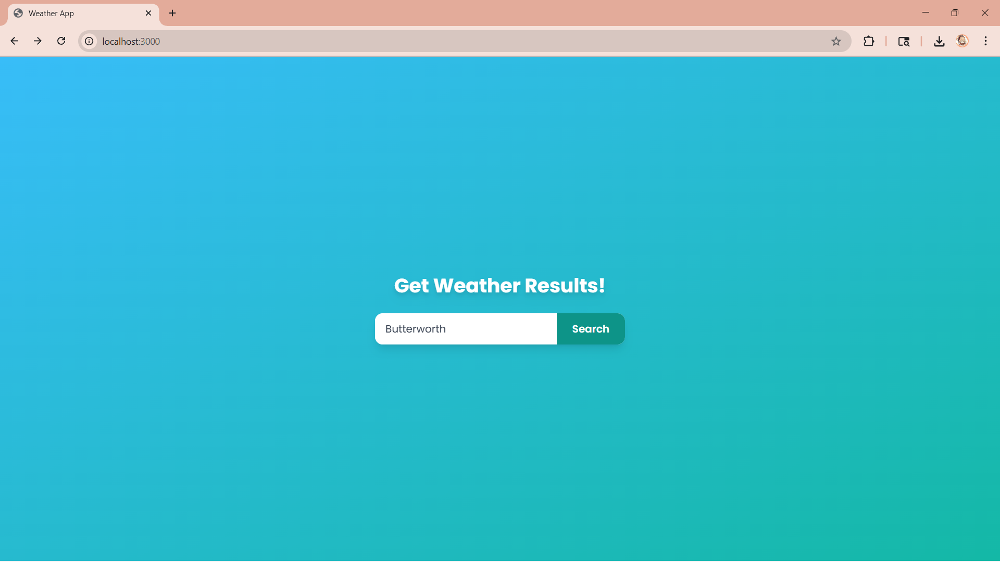
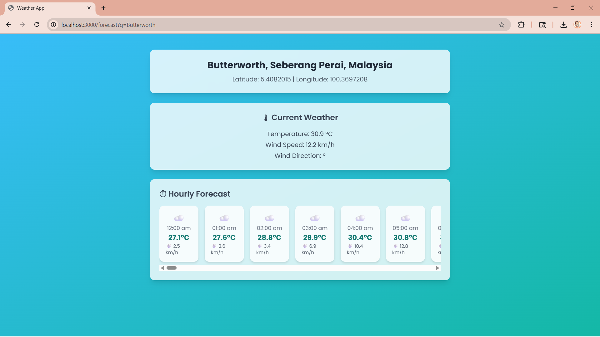

🌦️ Weather App

A simple weather application built with Node.js / Express (or whichever stack you used) that fetches and displays real-time weather information for any city using the OpenCage geocode API and Open-Meteo API.

🚀 Features

- Search weather by city name
- Displays temperature, humidity, wind speed, and condition (e.g., sunny, cloudy, rainy)

🛠️ Tech Stack

- Backend: Node.js, Express
- Frontend: HTML, CSS, JavaScript (EJS)
- API: OpenCage API, Open-Meteo API

## Screenshots

